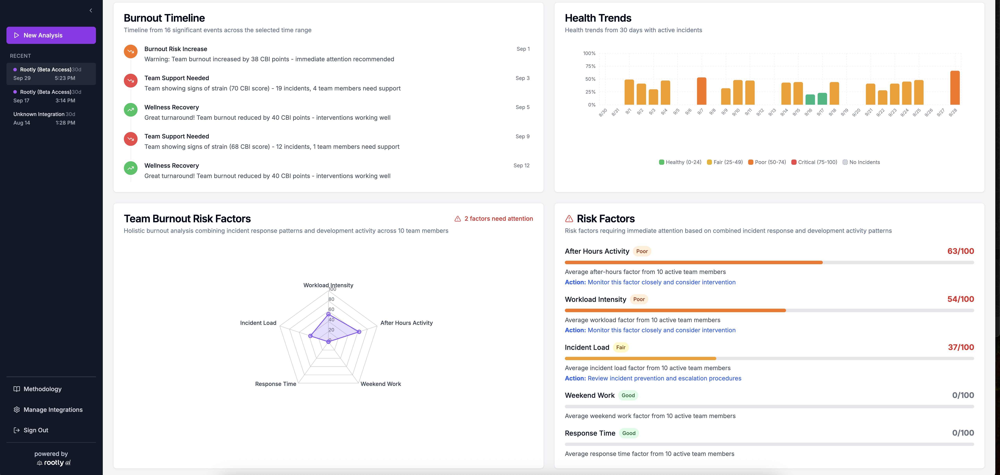

# Rootly Burnout Detector

A web application for detecting burnout risk in incident responder teams, using Rootly or PagerDuty incident data, GitHub activity, and Slack communication patterns.

We also offer a free hosted version at [www.oncallburnout.com](https://www.oncallburnout.com/)

The interface helps engineering managers spot team members who may be overworked or burned out. Our methodology is leveraging the [Copenhagen Burnout Inventory](https://nfa.dk/media/hl5nbers/cbi-first-edition.pdf) (CBI), which was developed by a team of Danish researchers. 



## ✨ Features

- **🔐 Social Authentication**: Login with Google or GitHub
- **📊 Interactive Dashboard**: Visual burnout risk analysis
- **👥 Team Management**: Individual and team-level insights
- **📈 Real-time Analysis**: Progress tracking during data processing
- **🔄 Analysis History**: Access previous assessments
- **📱 Responsive Design**: Works on desktop and mobile

## 🏗️ Architecture

### Tech Stack
- **Frontend**: React.js + TypeScript (Vercel)
- **Backend**: FastAPI + Python (Railway)
- **Database**: PostgreSQL (Railway)
- **Authentication**: OAuth (Google/GitHub) + JWT

### Project Structure
```
rootly-burnout-detector-web/
├── backend/                 # FastAPI application
│   ├── app/
│   │   ├── main.py         # FastAPI entry point
│   │   ├── core/           # Business logic & config
│   │   ├── models/         # Database models
│   │   ├── auth/           # Authentication
│   │   └── api/            # API endpoints
│   └── requirements.txt
├── frontend/               # Next.js application  
└── README.md
```

## 🚀 Quick Start

### Prerequisites
- Python 3.11+
- Node.js 18+ (for frontend)
- Rootly API token

### Backend Setup
```bash
cd backend
python -m venv venv
source venv/bin/activate  # or `venv\Scripts\activate` on Windows
pip install -r requirements.txt

# Copy and configure environment
cp .env.example .env
# Edit .env with your configuration

# Run the server
python -m app.main
```

The API will be available at `http://localhost:8000`

### Frontend Setup
```bash
cd frontend
npm install
npm run dev
```

The frontend will be available at `http://localhost:3000`

## 🔧 Configuration

### Environment Variables
```bash
# Required
DEBUG=True
SECRET_KEY=your-secret-key
DATABASE_URL=sqlite:///./test.db

# OAuth (optional for development)
GOOGLE_CLIENT_ID=your-google-client-id
GOOGLE_CLIENT_SECRET=your-google-client-secret
GITHUB_CLIENT_ID=your-github-client-id
GITHUB_CLIENT_SECRET=your-github-client-secret

# Rootly Integration
ROOTLY_API_BASE_URL=https://api.rootly.com
FRONTEND_URL=http://localhost:3000
```

## 🧪 Testing

```bash
cd backend
python -m pytest
```

## 📊 Burnout Analysis

The Burnout Detector takes inspiration from the **Copenhagen Burnout Inventory (CBI)** methodology - a scientifically validated approach to measuring burnout risk in professional settings. The Burnout Detector isn’t a medical tool and doesn’t provide a diagnosis; it is designed to help identify patterns and trends that may suggest overwork.

### CBI Methodology
Our implementation uses the two core CBI dimensions specifically validated for software engineering teams:

1. **Personal Burnout** (50% weight)
   - Physical and psychological fatigue from workload
   - Work-life boundary violations (after-hours/weekend work)
   - Temporal stress patterns and recovery time deficits

2. **Work-Related Burnout** (50% weight)
   - Fatigue specifically tied to work processes
   - Response time pressure and incident load
   - Team collaboration stress and communication quality

### Scoring System
- **0-24**: Low risk (sustainable workload)
- **25-49**: Moderate risk (monitor closely)
- **50-74**: High risk (intervention recommended)
- **75-100**: Critical risk (immediate action required)

### Enhanced Analysis (Optional)
- **GitHub Integration**: Development patterns and code review stress
- **Slack Integration**: Communication sentiment and after-hours activity
- **PagerDuty Integration**: Multi-platform incident correlation

## 🚢 Deployment

### Railway (Backend)
1. Connect GitHub repository
2. Set environment variables
3. Deploy automatically

### Vercel (Frontend)
1. Connect GitHub repository
2. Configure build settings
3. Deploy automatically

## 🔐 Security

- OAuth with Google/GitHub (no password storage)
- JWT tokens for session management
- Encrypted API token storage
- HTTPS enforcement
- Input validation and sanitization

## 📝 API Documentation

Once running, visit `http://localhost:8000/docs` for interactive API documentation.

## 🤝 Contributing

1. Fork the repository
2. Create a feature branch
3. Make your changes
4. Add tests
5. Submit a pull request

## 📄 License

This project is licensed under the MIT License.

## 🔗 Related Projects

- [Rootly CLI Burnout Detector](https://github.com/your-org/rootly-burnout-detector) - Command-line version
- [Rootly MCP Server](https://github.com/Rootly-AI-Labs/Rootly-MCP-server) - Model Context Protocol integration

---

Built with ❤️ by the [Rootly AI Labs](https://rootly.com/ai-labs) for engineering teams everywhere.
